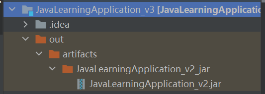
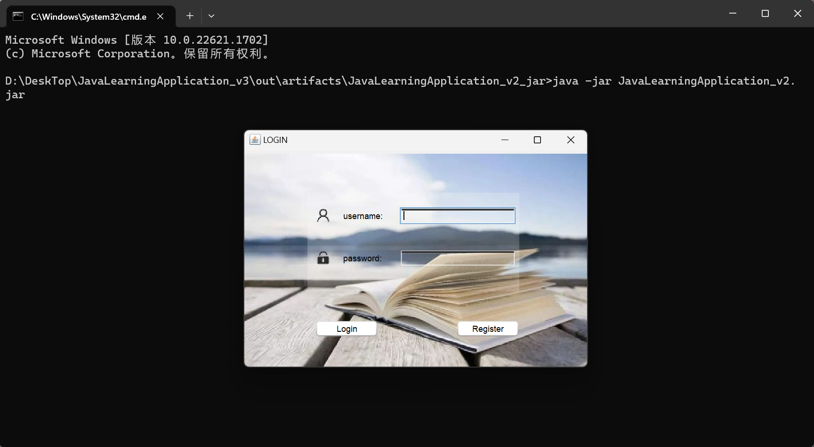

# Learning Management Software
Welcome to LMA, here you can generate your own schedule  
And you can plan your daily study courses  

```
Enviroment:
Operation system: windows
Java version: JDK 18
IDEA 2023
Maven 3.8.1
```

## Running
### Win
1. You are supposed to into the directory which have the jar file, then into the  
command line.

2. Using java -jar command to run it.
```
java -jar JavaLearningApplication_v2.jar
```

You can ignore the warning then you can run the project.
